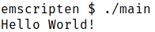
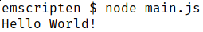
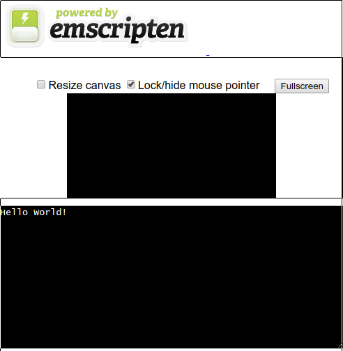

# C > JavaScript

Getting started with [Emscripten](http://kripken.github.io/emscripten-site/).  How to compile C-sources to .js and .html.

## What is Emscripten?
Emscripten is a toolchain for compiling to [asm.js](http://asmjs.org/) and [WebAssembly](https://webassembly.org/), built using [LLVM](https://llvm.org/), that lets you run C and C++ on the web at near-native speed without plugins.

Porting:
Compile your existing projects written in C or C++ and run them on all modern browsers.

APIs:
Emscripten converts OpenGL into WebGL, and lets you use familiar APIs like SDL, or HTML5 directly.

## Notes

Been a while since I touched Emscripten. Looks like some things changed. I was not entirely sure which package to install. I am on Arch-Linux; in the community repo is the emscripten package, which I used before. `AUR` offers `emsdk`, which looks like the way to go according to Emscripten's Site; but it is outdated.

To save time I used the community package, but failed compiling, I could not resolve the issues so I used the git-repo and finally I succeeded, see Installation.

## What is asm.js?

asm.js is a subset of JavaScript designed to allow computer software written in languages such as C to be run as web applications while maintaining performance characteristics considerably better than standard JavaScript, which is the typical language used for such applications.

<https://en.wikipedia.org/wiki/Asm.js>

## What is Webassembly?

WebAssembly is a new binary format for executing code on the web, allowing much faster start times (smaller download, much faster parsing in browsers) for Emscripten projects. Emscripten supports compiling to WebAssembly with a compiler flag, so it is easy for projects to target both WebAssembly and asm.js.

<https://emscripten.org/docs/compiling/WebAssembly.html>

<https://kripken.github.io/talks/wasm.html#/>
<https://hacks.mozilla.org/2015/12/compiling-to-webassembly-its-happening/>

<https://medium.com/@robaboukhalil/hit-the-ground-running-with-webassembly-56cf9b2fa35d>

### binaryen

Binaryen is a WebAssembly compiler toolkit, which Emscripten uses to modify and optimize wasm.

<https://emscripten.org/docs/compiling/WebAssembly.html>

### Emscripten SDK Installation

If you are not using Linux, see:
<https://emscripten.org/docs/getting_started/downloads.html>

The core Emscripten SDK (emsdk) driver is a Python script.

#### Get the emsdk repo

Note:
You can also get the **emsdk** without git, by selecting “Clone or download => Download ZIP” on the emsdk GitHub page.

 You can get it for the first time with:
`git clone https://github.com/emscripten-core/emsdk.git`

`cd emsdk`

Run the following emsdk commands to get the latest tools from GitHub and set them as active:

##### Fetch the latest version of the emsdk (not needed the first time you clone)
`git pull`

##### Download and install the latest SDK tools.
`./emsdk install latest`

##### Make the "latest" SDK "active" for the current user.

writes `~/.emscripten` config-file

`./emsdk activate latest`

##### Activate PATH and other environment variables in the current terminal
`source ./emsdk_env.sh`

##### Settings

If you want to use emscripten frequently it makes sense to apply the environment variables to the shell startup.

## Compiling C to JS

The basic command to compile to JS from C is:
`emcc main.c -o main.js`

If you invoke the Makefile with
`make`

and you have the environment variables properly set you should be able to to run what has been compiled.

## run with node.js

you can run the compiled C-executable.
`./main`

`node main.js`

## run in browser

To list considered browser run:
`emrun --list_browsers`

I am using chromium and is was not considered by `emrun`, but as you can see on the screenshot it still works.

`emrun --browser chromium main.html`

<https://emscripten.org/docs/compiling/Running-html-files-with-emrun.html>

## More Useful Links

[My C Snippets](https://gist.github.com/Acry/554e04bab3a2669a5ba2ecd4d673e875)  

[SDL2 Demos](https://acry.github.io/c.html)  

### Simliar Projects
C# > JS
<https://bridge.net/>